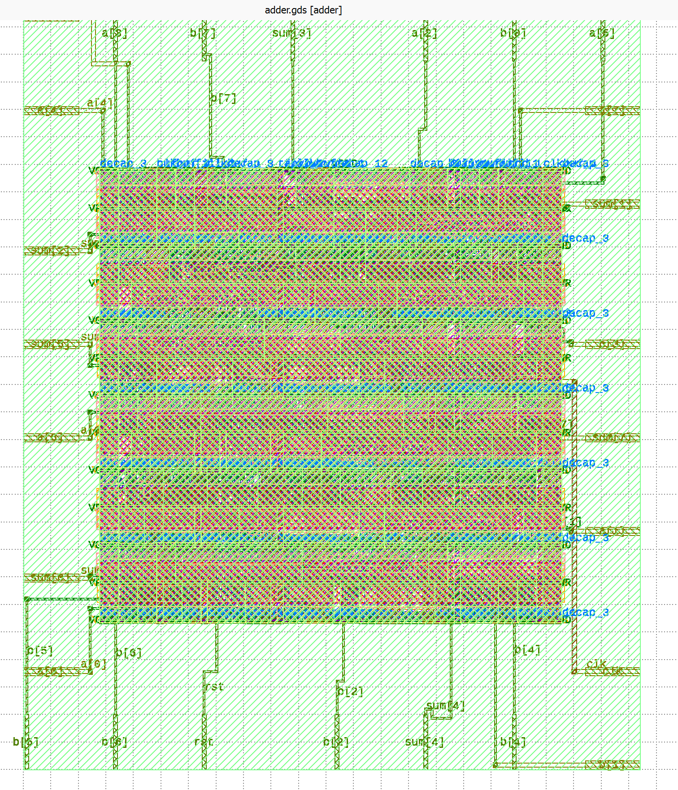
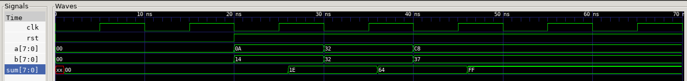

# Sky130 8-Bit Registered Adder: RTL-to-GDSII


Full front-to-back physical design of an 8-bit registered adder on the **SkyWater 130nm** open-source PDK. The flow was intentionally split: synthesis and gate-level simulation were done manually step by step, with OpenLane (Docker) handling automated place-and-route from a GLS-verified netlist.

---

## Post-Routing PPA Metrics

| Metric | Value | Notes |
| :--- | :--- | :--- |
| **Technology Node** | SkyWater 130nm | `sky130_fd_sc_hd` high-density library |
| **Core Area** | 1096.05 µm² | ~50% core utilization |
| **Clock Frequency** | 100 MHz | 10.0 ns period |
| **Critical Path Delay** | 1.44 ns | 8.56 ns positive slack |
| **Setup / Hold Violations** | 0 | Timing closure fully achieved |
| **Total Power (typical)** | ~100 µW | Switching: ~37.2 µW |
| **Total Standard Cells** | 176 | Including `decap` and `fill` cells |
| **Sequential Cells** | 8 | Sky130 D-Flip Flops (`dfrtp`) |
| **Wire Length / Vias** | 1324 / 447 | Post-routing |

---

## Architecture

8-bit combinational adder feeding a synchronous output register — creating a clean sequential boundary for STA.
```
  a[7:0] ──┐
            ├──► [8-bit Adder] ──► [8-bit Register] ──► sum[7:0]
  b[7:0] ──┘                            ▲
                                       clk / rst
```

---

## Flow

### Phase 1 — Manual (RTL → Netlist → GLS)

**Synthesis (Yosys)** — run interactively to map RTL to Sky130 standard cells (`maj3`, `nand2`, `xor2`, `dfrtp`):
```bash
read_verilog adder.v
synth -top adder
dfflibmap -liberty sky130_fd_sc_hd__tt_025C_1v80.lib
abc -liberty sky130_fd_sc_hd__tt_025C_1v80.lib
write_verilog -noattr adder_netlist.v
```

**Gate-Level Simulation (iVerilog + GTKWave)** — netlist verified functionally before handing off to physical design. Both Cocotb (Python) and a pure Verilog testbench were used; the Verilog testbench was required for GLS correctness (see Debugging section).

### Phase 2 — Automated (OpenLane via Docker)

A `config.json` was written to define constraints; OpenLane ran floorplan, placement, CTS, and routing automatically:
- **Routing:** TritonRoute — zero DRC violations
- **Signoff:** Magic DRC  | Netgen LVS

---

## Layout

<p align="center">
  
  <br>
  <em>Final routed GDSII layout in KLayout. Standard cell rows, PDN stripes, and Metal 1/2 routing visible.</em>
</p>

---

## 🔬 GLS Debugging: Resolving the X-State Problem

**Problem:** Sky130 flip-flops power up in an unknown `X` state. When using Cocotb, VPI bridging delays caused the active-low reset to miss the Time-0 initialization window, permanently locking outputs to `X`.

**Solution:** Switched to a pure Verilog testbench (zero VPI overhead, reset asserted at exact picosecond zero) and compiled with functional timing flags:
```bash
iverilog -DFUNCTIONAL -DUNIT_DELAY=#1 \
  sky130_fd_sc_hd.v primitives.v \
  adder_netlist.v tb_adder.v -o sim_out
```

<p align="center">
  
  <br>
  <em>GTKWave after the fix — synthesized internal nets (e.g., <code>_060_</code>) visible alongside correct hex outputs.</em>
</p>

---

## 📂 Repository Structure
```
├── src/
│   ├── adder.v                # Behavioral RTL
│   └── tb_adder.v             # Pure Verilog testbench (GLS-compatible)
├── netlist/
│   └── adder_netlist.v        # Synthesized gate-level netlist (Yosys)
├── openlane/
│   └── config.json            # OpenLane constraints
├── images/                    # Layout, waveform screenshots
├── metrics.csv                # Final OpenLane PPA report
└── README.md
```

---

## ⚙️ Reproducing the Flow

**Synthesis:**
```bash
yosys -p "read_verilog src/adder.v; synth -top adder; \
  dfflibmap -liberty <sky130.lib>; abc -liberty <sky130.lib>; \
  write_verilog -noattr netlist/adder_netlist.v"
```

**GLS:**
```bash
iverilog -DFUNCTIONAL -DUNIT_DELAY=#1 \
  <sky130_models>/sky130_fd_sc_hd.v <sky130_models>/primitives.v \
  netlist/adder_netlist.v src/tb_adder.v -o gls_sim && vvp gls_sim
gtkwave dump.vcd
```

**Physical Design:**
```bash
make mount                          # Start OpenLane Docker container
./flow.tcl -design registered_adder -tag run_1
```

---

## 🛠️ Tools

| Tool | Purpose |
| :--- | :--- |
| Yosys | RTL synthesis → Sky130 netlist |
| iVerilog + GTKWave | Simulation and waveform inspection |
| Cocotb | Python testbench exploration |
| OpenLane (Docker) | Floorplan, placement, CTS, routing |
| Magic / Netgen | DRC / LVS signoff |
| KLayout | GDSII visualization |
